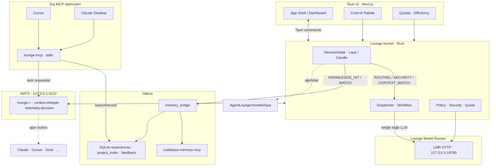

# Agent Lounge OS

<p align="center">
  
</p>

<p align="center">
  <strong>Yerel çok ajanlı orkestrasyon katmanı</strong><br />
  <em>Local multi-agent orchestration — Rust · NATS · Native Laya inference</em>
</p>

**Agent Lounge OS**, Claude, Cursor, Grok ve yerel modellerin aynı makinede düşük gecikmeyle haberleştiği, gizlilik odaklı bir masaüstü işletim katmanıdır. Bulut yönlendiricisi veya host Ollama’ya bağımlı bir “wrapper” değildir: karar motoru **native Rust DecisionGate (OpenJev Laya)**, model koşusu **Lounge Model Runner (LMR)** ve ajanlar arası bus **NATS** üzerindedir.

| | |
|---|---|
| **Stack** | Rust (Tokio) · Tauri 2 · Next.js · NATS · SQLite |
| **Inference** | Candle + Laya (`DecisionGate`) — isteğe bağlı LMR (`127.0.0.1:18790`) |
| **Hafıza** | `memory_bridge` → codebase-memory-mcp · experience store |
| **MCP** | `lounge-mcp` stdio sunucusu — Cursor / Claude Desktop |
| **Lisans / hedef** | Local-first · tek binary masaüstü kabuğu |

---

## Neden diğerlerinden farklı?

Çoğu “agent IDE eklentisi” host Ollama’ya veya bulut LLM’e bağlanır, bağlamı tek projede tutar ve güvenlik için regex/heuristic kullanır. Lounge farklı bir omurga kurar:

| Fark | Ne sağlar |
|------|-----------|
| **Native DecisionGate / Laya** | Her NATS mesajı için Candle üzerinde yerel sınıflandırma: `ROUTING`, `SECURITY`, `CONTEXT_MATCH`. Ağırlıklar HF’den `AgentLounge/models/laya` altına iner; RAM’e yüklenir. |
| **Cross-project memory + context whisper** | Benzer görevler SQLite + vektör + AST üzerinden bulunur; eşleşince ajanlara `lounge.context.whisper` ile system-prompt fısıltısı gider. |
| **Security interceptor** | Laya `SECURITY` çıktısı kritik/riskli işleri onay akışına alır; politika katmanı Kernel içinde çalışır. |
| **Quota gate → LMR (host Ollama değil)** | Kota ve model rotası **Lounge LMR** (`:18790`) üzerinden. Host EchoMind/Cursor Ollama (`:11434`) **bilinçli olarak dokunulmaz**. |
| **Multi-agent workflow** | Dispatcher + workflow engine: görev dağıtımı, onay, quota exhausted politikaları. |
| **Semantic map + dead symbols** | `memory_bridge` / codebase-memory-mcp ile çağrı grafiği, ölü semboller ve proje haritası. |
| **Cmd+K palette** | Experience store + memory_bridge üzerinde hızlı komut / proje / Grok test paleti. |
| **Feedback bias** | Kullanıcı approve/deny istatistikleri skor sonrası bias uygular (model yeniden eğitilmez). |
| **Efficiency report** | Fısıltı enjeksiyonları, gecikme ve ajan verimliliği telemetrisi. |
| **Lounge MCP** | Cursor / Claude Desktop, stdio MCP ile tecrübe ara/kaydet ve NATS üzerinden görev iletir. |

> **Lounge LMR ≠ host Ollama.** LMR kapalı devre bir örnekdir (`LOUNGE_OLLAMA_PORT=18790`, ayrı `data/lmr` runtime). Sistemdeki `~/.ollama` / Ollama.app / `:11434` ayrı kalır.

---

## Mimari



**Akış (özet):** UI veya ajan NATS’a mesaj yazar → Kernel `DecisionGate` Laya ile sınıflandırır → güvenlik/kota uygulanır → gerekirse LMR’ye gider veya cross-project context fısıltılanır → sonuçlar experience store’a yazılır.

Dış IDE’ler (`Cursor` / `Claude Desktop`) Lounge’u **MCP tool** olarak çağırabilir — ayrıntı: [`docs/mcp.md`](docs/mcp.md).

---

## Ekran görüntüleri

Logo: [`public/logo.png`](public/logo.png)

Ürün görselleri `docs/screenshots/` altına eklenir (şu an yer tutucu — ayrıntı: [`docs/screenshots/README.md`](docs/screenshots/README.md)):

| Önizleme | Dosya |
|----------|--------|
| Dashboard | `docs/screenshots/dashboard.png` |
| DecisionGate / Laya | `docs/screenshots/decision-gate.png` |
| Cmd+K | `docs/screenshots/command-palette.png` |
| Semantic map | `docs/screenshots/semantic-map.png` |
| Quotas | `docs/screenshots/quotas.png` |
| Efficiency | `docs/screenshots/efficiency.png` |

```markdown
<!-- Görseller eklendikten sonra örneğin: -->

```

---

## Kurulum

### Önkoşullar

| Bileşen | Not |
|---------|-----|
| **Node.js** | LTS (18+) — `npm` |
| **Rust** | `rust-toolchain.toml` → channel `1.98.0` (+ rustfmt, clippy) |
| **Tauri 2** | [Tauri prerequisites](https://v2.tauri.app/start/prerequisites/) (macOS: Xcode CLT; Linux: webkitgtk vb.) |
| **NATS Server** | Yerel bus (`4222` / monitor `8222`) — uygulama yaşam döngüsünü de yönetebilir |
| **LMR** | Lounge’a özel Ollama-uyumlu binary; host Ollama’dan ayrı dizin |

### Hızlı başlangıç

```bash
git clone <repo-url> Agent-Lounge-OS
cd Agent-Lounge-OS

npm install
npm run tauri dev
```

İlk açılışta Kernel NATS ve LMR sağlık durumunu kontrol eder. Host Ollama (`:11434`) çalışıyor olsa bile LMR kendi portunda (`:18790`) ve kendi `data/lmr` dizininde kalır.

### Laya (native DecisionGate) — isteğe bağlı

HF deposu: [`convaiinnovations/laya`](https://huggingface.co/convaiinnovations/laya)

Üretim yolu (OS app-support, kimlik **AgentLounge**):

| OS | Dizin |
|----|--------|
| macOS | `~/Library/Application Support/AgentLounge/models/laya` |
| Linux | `$XDG_DATA_HOME/AgentLounge/models/laya` veya `~/.local/share/AgentLounge/models/laya` |
| Windows | `%APPDATA%\AgentLounge\models\laya` |

`LOUNGE_LAYA_DIR` tam yolu ezer. UI’dan “Laya’ya geç” ile indirme/yükleme tetiklenebilir; yoksa Kernel LMR ile devam eder.

### Ortam değişkenleri (seçilmiş)

| Değişken | Anlam |
|----------|--------|
| `LOUNGE_OLLAMA_PORT` | LMR portu (varsayılan **18790**) |
| `LOUNGE_LMR_DIR` | LMR runtime (varsayılan `data/lmr`) |
| `LOUNGE_LMR_BINARY` | LMR binary yolu |
| `LOUNGE_NATS_DIR` | NATS veri dizini |
| `LOUNGE_LAYA_DIR` | Laya ağırlık dizini |
| `OLLAMA_HOST` | Yalnızca **host** Ollama (Lounge LMR değil) |

### Yararlı komutlar

```bash
npm run tauri dev      # masaüstü + Next.js
npm run build          # Next production build
npm run types:check    # typegen + tsc
npm run ci             # lint + types + build
cargo build --manifest-path src-tauri/Cargo.toml --bin lounge-mcp --release   # MCP sidecar
```

### Cursor / Claude Desktop (MCP)

Kernel masaüstü uygulaması **`http://127.0.0.1:18791`** üzerinde MCP HTTP sunar. `lounge-mcp` binary Claude/Cursor için **stdio shim** olup bu HTTP’ye proxy eder (dashboard `connected_tools` ile senkron). Kernel kapalıysa shim gömülü SQLite moduna düşer.

Hazır snippet’ler: **[`docs/mcp.md`](docs/mcp.md)**.

**Cursor** — `.cursor/mcp.json` (yolları mutlak yapın):

```json
{
  "mcpServers": {
    "agent-lounge-os": {
      "command": "/ABS/PATH/TO/src-tauri/target/release/lounge-mcp",
      "args": [],
      "env": {
        "LOUNGE_MCP_URL": "http://127.0.0.1:18791",
        "LOUNGE_DB_PATH": "/ABS/PATH/TO/experiences/lounge.sqlite"
      }
    }
  }
}
```

**Claude Desktop** — `claude_desktop_config.json` içinde aynı `mcpServers` bloğu.

`lounge_dispatch_task` için NATS + Kernel gerekir (PENDING_APPROVAL / kota baypas edilmez). MCP dosya yazmaz ve ayar değiştirmez.

---

## Proje yapısı

```text
Agent-Lounge-OS/
├── src/                 # Next.js UI (dashboard, palette, quotas)
├── src-tauri/           # Rust Kernel: DecisionGate, LMR, NATS, memory
│   └── src/bridge/      # lounge-mcp (MCP stdio sunucusu)
├── shared/              # lounge_protocol (NATS zarfı + şemalar)
├── docs/mcp.md          # Cursor / Claude bağlantı kılavuzu
├── public/logo.png
├── docs/screenshots/    # ürün görselleri (yer tutucu)
└── data/                # yerel LMR / NATS (git’e girmeyebilir)
```

---

## İlgili proje

[EchoMind](https://github.com/sewox/EchoMind) — aynı local-first felsefede gizlilik odaklı toplantı asistanı. EchoMind host Ollama kullanabilir; **Lounge LMR ondan izole** tutulur.

---

## English summary

**Agent Lounge OS** is a local multi-agent orchestration layer (Rust + Tauri + Next.js + NATS). Decisions run through a native **DecisionGate** powered by **Laya** (Candle), not a cloud router. Model calls go to **Lounge LMR** on `127.0.0.1:18790` — **not** the host Ollama instance on `:11434`. Cross-project memory injects context via `lounge.context.whisper`; security, quotas, semantic maps, Cmd+K, feedback bias, and efficiency reports complete the engineering-focused desktop shell. External agents connect via the **`lounge-mcp`** stdio MCP server (see `docs/mcp.md`).

```bash
npm install && npm run tauri dev
```
